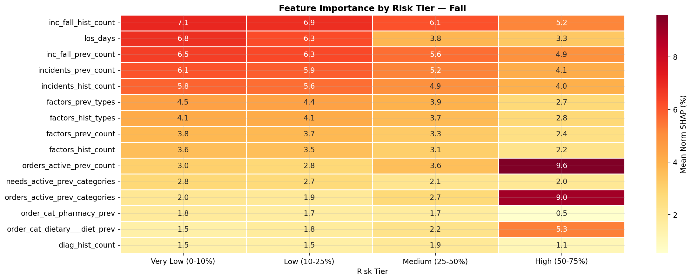
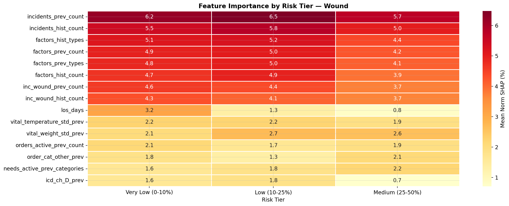
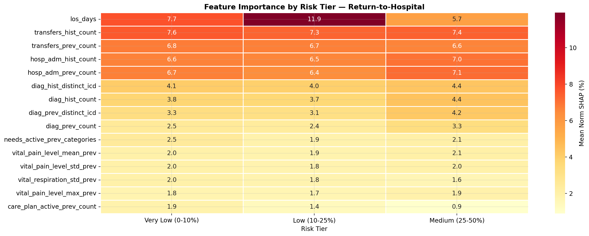
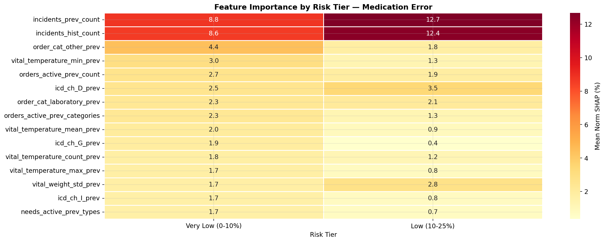
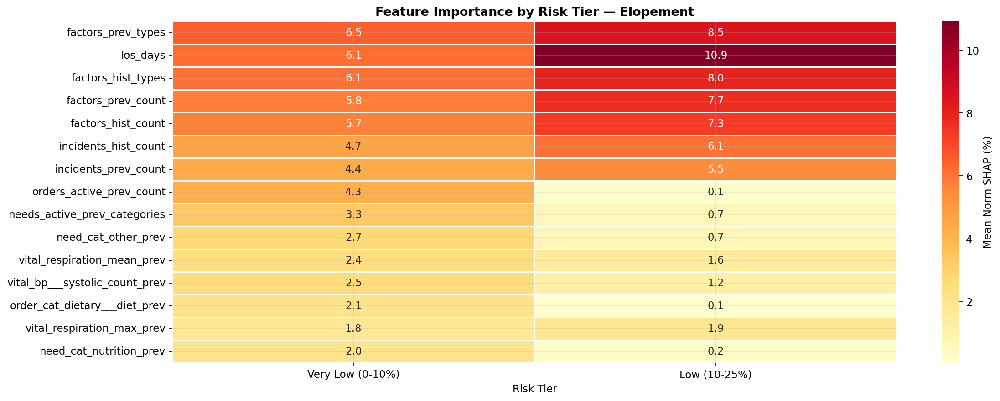
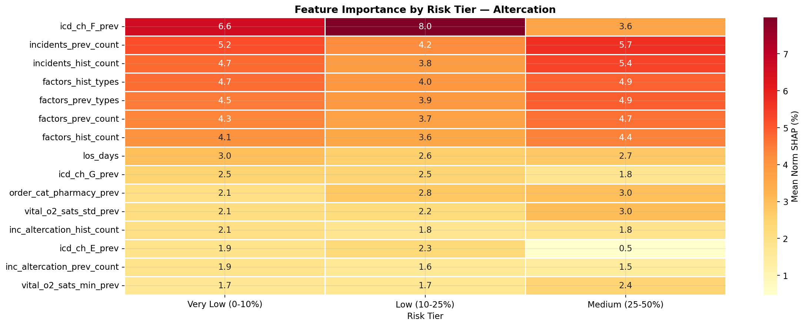

# Case Tricuta - Nursing Facility Claims Prediction

Predicting 7 types of insurance claims in skilled nursing facilities using **Random Forest** models with **SHAP explainability**, built on 17 clinical and operational data sources.

## Results

| Claim Type | CV AUC | Validation AUC | Val F1 | Train Positives |
|---|---|---|---|---|
| **Fall** | 0.902 | 0.884 | 0.768 | 1,121 |
| **RTH (Return-to-Hospital)** | 0.907 | 0.901 | 0.472 | 883 |
| **Wound** | 0.869 | 0.867 | 0.713 | 341 |
| **Altercation** | 0.832 | 0.828 | 0.560 | 115 |
| **Medication Error** | 0.722 | 0.628 | — | 28 |
| **Elopement** | — | — | — | 6 |
| **Choking** | — | 0.172 | — | 6 |

> Models trained on data before Nov 2024, validated on Dec 2024 + Jan 2025, predictions for Feb 2025.

### Example: SHAP Feature Importance — Fall Claims

<!-- Replace with your actual screenshot -->


*Each dot represents a resident. Position on the X-axis shows the SHAP value (impact on prediction). Color indicates the feature value (blue = low, red = high). Features sorted by global importance.*

### Example: Cross-Claim Feature Comparison

<!-- Replace with your actual screenshot -->


*Normalized SHAP values allow direct comparison of feature importance across different claim types.*

---

## Project Structure

```
├── README.md
├── requirements.txt
├── data/                          # Raw parquet files (not committed)
│   ├── residents.parquet
│   ├── incidents.parquet
│   ├── diagnoses.parquet
│   └── ... (17 tables)
│
├── notebooks/
│   ├── 01_data_treatment.ipynb    # Initial data exploration
│   ├── 02_build_panels.ipynb      # Build monthly panel datasets
│   ├── 03_model_training.ipynb    # Train RF + SHAP for all claims
│   ├── 04_analysis_fall.ipynb     # Deep dive: Fall claims
│   └── 05_analysis_all_claims.ipynb  # Full analysis: all 7 claim types
│
├── src/
│   ├── build_monthly_panels.py    # Panel dataset construction
│   └── model_claims.py            # Model training pipeline
│
├── output_data/                   # Generated outputs (not committed)
│   ├── claims_fall_monthly.parquet
│   ├── predictions_fall.parquet
│   ├── shap_normalized_fall.parquet
│   ├── model_rf_fall.joblib
│   └── ...
│
└── images/                        # Screenshots for README
    ├── shap_beeswarm_fall.png
    ├── cross_claim_heatmap.png
    └── ...
```

---

## Data Pipeline

### Source Data (17 tables)

Clinical and operational data from skilled nursing facilities, linked by `resident_id`:

| Table | Records | Key Fields |
|---|---|---|
| `residents` | Demographics | admission/discharge dates, DOB |
| `incidents` | Falls, wounds, elopements... | `incident_type`, `occurred_at` |
| `injuries` | Linked to incidents | injury type, location |
| `diagnoses` | ICD-10 codes | onset, resolved dates |
| `medications` | 1.4M+ records | description, status, schedule |
| `vitals` | Vital signs | type, value, measured_at |
| `lab_reports` | Lab results | severity status |
| `hospital_transfers` | RTH events | reason, emergency flag |
| `hospital_admissions` | Hospital stays | duration, emergency |
| `care_plans` | Active care plans | initiation, closure |
| `needs` | Patient needs | type, category |
| `physician_orders` | Active orders | category, frequency |
| `therapy_tracks` | PT/OT/SLP | discipline, duration |
| `adl_responses` | Daily living assessments | activity, response score |
| `gg_responses` | Functional assessments | task group, response code |
| `document_tags` | Clinical documents | doc type, confidence |
| `factors` | Incident contributing factors | factor type |

### Panel Construction (Point-in-Time)

Each of the 7 claim types gets its own monthly panel dataset with grain **`resident_id × year_month`**:

- A resident is **active** in a month if admitted before month-end and not discharged before month-start
- All features use data **strictly before** the target month (no data leakage)
- Feature types:
  - `_hist_` — cumulative count from all prior months
  - `_prev_` — value from the immediately preceding month (lag-1)
  - `*_prev` — snapshot of active records (diagnoses, orders, therapies) as of end of previous month
  - Vitals, labs, medications, ADL, GG — monthly statistics lagged by 1 month

This design ensures the model only sees information that would be **available at prediction time**.

---

## Modeling

### Random Forest Classifier

- **500 trees**, max depth 15, `max_features='sqrt'`
- **SMOTE** applied on the training set to handle class imbalance (with dynamic `k_neighbors` based on minority count)
- Fallback to `class_weight='balanced'` for very rare claims (< 3 positives)
- 5-fold stratified cross-validation (SMOTE applied inside each fold to prevent leakage)

### Time Split

| Set | Period | Purpose |
|---|---|---|
| **Train** | All months < 2024-11 | Model fitting (28,213 resident-months) |
| **Validate** | 2024-12 + 2025-01 | Performance metrics (2,257 resident-months) |
| **Predict** | 2025-02 | Final predictions + SHAP analysis (935 residents) |

### Outputs per Claim Type

| File | Description |
|---|---|
| `model_rf_<claim>.joblib` | Trained model + metadata |
| `predictions_<claim>.parquet` | Resident-level predictions + probabilities |
| `shap_normalized_<claim>.parquet` | Per-patient SHAP (% contribution per feature) |
| `shap_raw_<claim>.parquet` | Per-patient signed SHAP values |
| `shap_global_<claim>.parquet` | Global feature importance (mean |SHAP|) |
| `validation_<claim>.parquet` | Validation set predictions |

---

## SHAP Explainability

### What are SHAP Values?

**SHAP (SHapley Additive exPlanations)** values decompose each prediction into individual feature contributions. For every resident and every feature, SHAP tells you:

- **Sign**: Does this feature push the prediction toward a claim (+) or away from it (−)?
- **Magnitude**: How much does it contribute?

This is based on Shapley values from cooperative game theory — each feature's contribution is calculated as the average marginal contribution across all possible feature combinations.

### Normalization for Cross-Claim Comparison

Raw SHAP values are model-specific and not directly comparable across claim types. We normalize them:

For each resident, the normalized SHAP values sum to **100%**, representing the percentage contribution of each feature to that prediction. This allows comparing feature importance across different claim models (e.g., "age contributes 12% to fall predictions vs. 3% to elopement predictions").

```
normalized_SHAP_i = |SHAP_i| / Σ|SHAP_all| × 100%
```

---

## Setup

### Requirements

```bash
pip install pandas numpy scikit-learn imbalanced-learn shap joblib matplotlib seaborn
```

### Running the Pipeline

```bash
# 1. Build monthly panel datasets
python src/build_monthly_panels.py

# 2. Train models + generate predictions/SHAP
python src/model_claims.py

# 3. Open analysis notebooks
jupyter notebook notebooks/05_analysis_all_claims.ipynb
```

---

## Results

### Fall


### Wound




### RTH




### Medication Error




### Elopement




### Altercation




## Overall Results

Fall - It seems that keeping a lookout for Active Orders, expecially when is a diatery order, those client seem to fall more in the next month.

Wound - Clients with previoes incidents of wound have more probability of having wounds in the future.

Return-to-Hospital - The amount of days the person stays in the facility, more RTH claims they have, this is the main culprit from the analysis. But the track record of having Hopital Admissions have also a big impact.

Altercation - Pacients that just came to the nursing home don't have much altercation. What it seems is that people with history of altercations (trouble makers) are the one to keep a lookout for. It seems that people who ask for medicine more often, probably depending on the medicine, have more altercation.

Medication Error - This happens mainly with people with previoes medication errors, watch out places and residents when medication error happens once.

Elopement - Happens with people that stay long in the nursing home and have of history of incidents and factors. The more the resident has problems in the nursing home, the more chance for him to elope.

Choking - It seems that people with Genitourinary  diseases and people with more order from pharmacy happen to be a hazard to choke. But the data sample is small to have any type of conclusion to that end.

---

## License

This project was developed as a case study for claims prediction in skilled nursing facilities.
